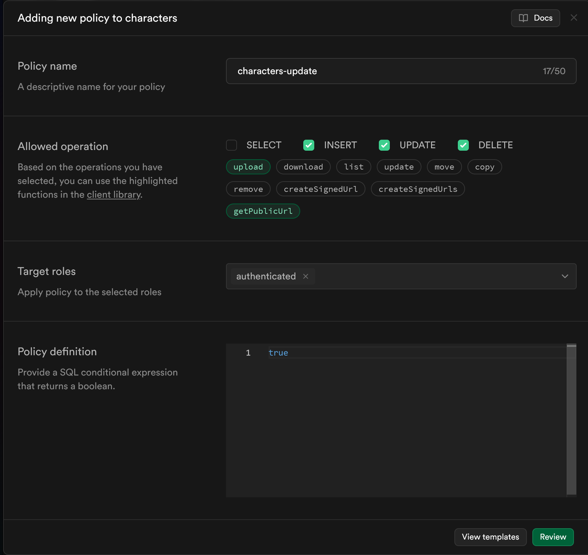

## Steps

1. Clone this project `git clone https://github.com/scottbenton/Iron-Link-React.git`
2. Install node v18 and npm v10

  1. Follow [these instructions](https://github.com/nvm-sh/nvm?tab=readme-ov-file#installing-and- ) to install nvm
  2. Switch to project dir and `nvm install` to install and configure the correct node version

3. Follow these instructions to [Install docker](https://www.docker.com/get-started/)

4. Install dependencies `npm i`
5. Create an `.env.local` file (see `.env.local` below)
6. Run supabase locally (see Supabase Setup below)
7. Run `npm run dev` and go to your browser to see the output.

## .env.local

Create a new file in the root of this repository, named `.env.local`. This file will hold environment variables representing credentials needed to connect your instance with supabase.

Copy the following into your `.env.local` file

```
VITE_SUPABASE_URL=http://localhost:54321 # Yours might be different, but this is the default
VITE_SUPABASE_ANON_KEY=RANDOM_KEY_HERE # This key will be spit out by the supabase CLI when starting it for the first time
```

As you start up supabase locally, you will get values to fill these config values in.

## Supabase Setup

Supabase provides authentication, database, and image storage to this application.

The first step is to start the local version of supabase. Make sure you have docker installed and running on your machine, then run `npm run supabase:start` in order to launch your docker containers. Once your local development setup has started, it should output a bunch of URLs and keys into the console. You need to copy the value of the `API URL:` and the `anon key:` into your `.env.local` file in order for the UI to be able to communicate with Supabase.

Once supabase has launched, we need to make a couple more configuration changes - unfortunately supabase does not allow these to be as easily configured, so we need to set them up manually.

1. Launch Supabase Studio - it should be running at `localhost:54323`. You can use the studio to check the values in the database and storage buckets, easily manage tables, and to check the supabase logs.
2. Navigate to `storage` on the lefthand side, and create a new storage bucket called `characters`, using the following settings. 
3. Add a policy to your storage bucket - this policy is not secure for a production environment, but works fine for development 

--------------------------------------------------------------------------------

With that, you should be all set up and ready to develop locally!
